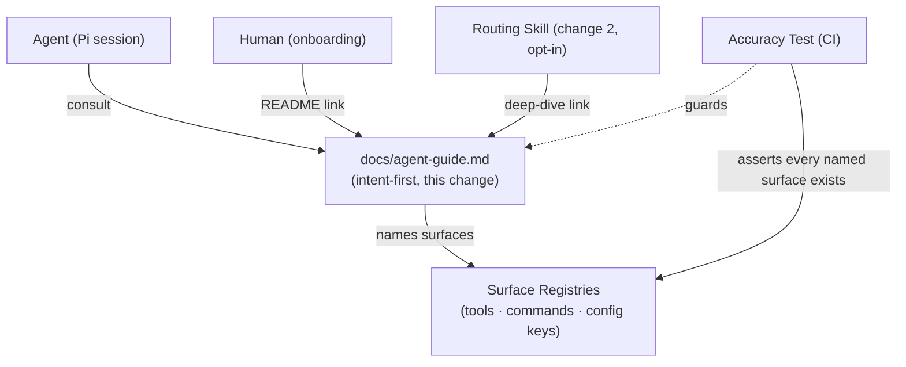

## Context

The extension now has four distinct surface classes — CGC MCP graph tools (query engine, not this extension's), built-in harness search/read, `/cgc` slash commands, and the CLI-gap tools — plus automatic behaviors (lifecycle gate, freshness sync). Guidance for choosing among them is currently spread across injected guidelines (compact, always-on) and the opt-in routing skill (deep, opt-in). What is missing is the always-available reference document: a prior project demonstrated that an `agent-guide.md` written for the agent as a first-class reader, kept accurate by tests, becomes the canonical onboarding artifact for both agents and humans.

In-force ADRs: `adr/0001` through `adr/0009` all apply as the factual basis the guide documents; none are modified. `adr/0008` (worktree isolation via named contexts) governs the worktree/named-context interplay the guide's named-context management section must document, and `adr/0009` (two-tier proactive injection) defines the injected-guidelines-versus-opt-in-skill split — the exact two-tier guidance model this change's guide documents — including the proactive config keys the consent overview must describe. This change is documentation-only.

## Goals / Non-Goals

**Goals:**

- One intent-first document answering "I want to know X — which surface?" for every capability in the extension.
- Guaranteed accuracy: a CI test asserts every surface named in the guide exists, so the guide cannot silently drift.
- Discovery from both audiences' entry points: README for humans, routing skill for agents.

**Non-Goals:**

- No runtime behavior, tool registration, or prompt injection (documentation only).
- No duplication of the routing skill or injected guideline content — the guide is the deep reference those layers point to.
- No CGC documentation rewriting: the guide links to CGC's own docs for tool-internal details and summarizes only the caveats that affect surface choice.
- No translations in this change (consistent with CGC's own translation model; can follow later).

## Decisions

### D1: Intent-first organization, not tool-by-tool

**Decision:** The guide's primary structure is a routing table keyed by the question being asked, with tool reference sections kept secondary and brief.

**Rationale:** The reader's state is a question, not a tool name; a prior project's guide demonstrated this organization, and it matches how the injected guidelines teach (change 2), so skill and guide reinforce each other.

**Alternatives considered:**

- *Tool-by-tool reference manual* — rejected: answers "what does X do" but not "which X should I use", which is the actual failure mode.
- *Per-surface README sections only* — rejected: README is for humans adopting the extension; the agent needs one stable document to consult.

### D2: Accuracy as a CI gate, not a hope

**Decision:** A test extracts the surfaces named in the guide (tool names, `/cgc` commands, config keys) and asserts each exists in the implemented registries; renames fail CI until the guide is updated. The same mechanism backs the guide's scope line (supported CGC version range).

**Rationale:** Documentation drift is the historical failure mode of agent-facing docs; a prior project's eval-suite discipline and the collision test from change 6 both point the same way — make drift mechanical to catch.

**Alternatives considered:**

- *Manual review checklist* — rejected: relies on memory; the whole campaign's posture is to make correctness structural.
- *Generate the guide from registries* — rejected: generated prose loses the worked-example and intent-first quality; a hybrid (test against registries, write prose by hand) keeps both.

### D3: The guide is referenced, never duplicated, by the skill

**Decision:** The routing skill's deep-dive section links to the guide; only the guide carries the full routing table and example session.

**Rationale:** Duplication guarantees divergence; the skill's compact scope (change 2) and the guide's depth stay complementary by construction.

**Alternatives considered:**

- *Inline the routing table into the skill* — rejected: skill content budget (~10 lines card, deep section opt-in) cannot hold the full table, and copies drift.

### Architecture (C4 — context level; documentation change)

## Risks / Trade-offs

- [Guide drifts from reality between releases] -> Accuracy test makes drift a CI failure; scope line plus versioned releases bound the maintenance window.
- [Guide grows into a second README nobody reads] -> Length cap enforced in review; intent table first, reference sections minimal, links out to CGC docs for depth.
- [Example session goes stale after behavior changes] -> The example is covered by the same accuracy assertion (its named surfaces must exist), and behavior changes in this campaign always list the guide in their task checklists.
- [Two audiences, one document] -> Accepted: a prior project's precedent shows one intent-first doc serves both; the README link and skill link are thin pointers, not copies.

## Migration Plan

- No migration. Rollback = remove the doc and test (no runtime surface affected).

## Open Questions

- None blocking.
