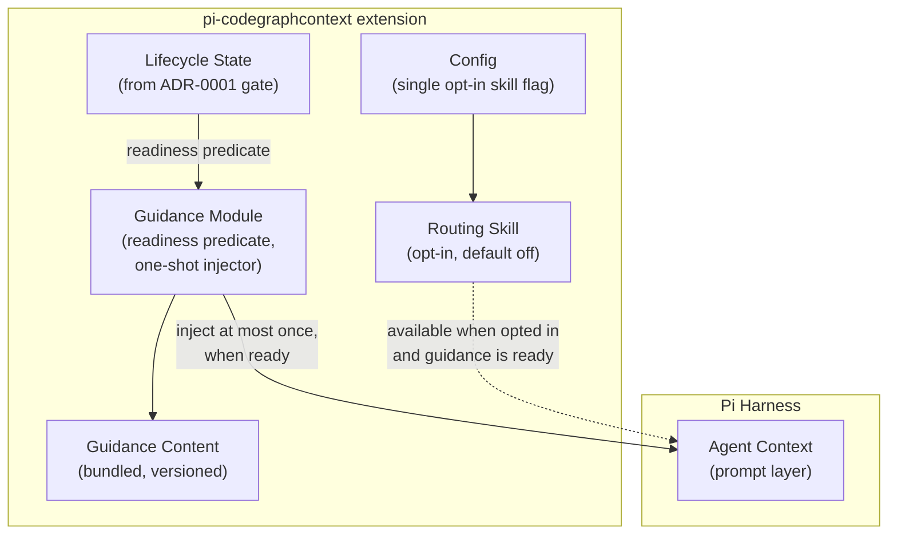

## Context

The extension's guidance layer answers a question the CGC MCP server cannot: not "what tools exist" but "when should the agent reach for them." CGC ships an agent-facing skill for Cursor (`.cursor/skills/codegraphcontext/SKILL.md`) but nothing Pi-native. Reference-extension research reportedly shows two failure modes this design must avoid: guidance injected before tools/index are ready causes hallucinated tool calls (a failure mode downstream forks have reportedly fixed repeatedly), and unconditional prompt injection adds permanent overhead users resent (reference extensions reportedly ship prompt-injection toggles for exactly this reason).

In-force ADRs: `adr/0001-cgc-binary-only-integration.md` (Proposed) — wrap-only integration, fail-open posture, no query tools registered by the extension. This design stays inside those constraints; in particular, guidance names MCP graph tools but registers none.

## Goals / Non-Goals

**Goals:**

- Correct tool selection: relationship-shaped questions route to graph queries; exact-string work stays with built-in search/read.
- Zero-risk delivery: guidance never fires before it can be true (readiness gate), never blocks the session, never repeats per turn.
- Respect user attention: the always-on guideline set is compact; the deep material lives behind an opt-in skill (disabled by default).

**Non-Goals:**

- No tool registration of any kind (per ADR-0001; the CGC MCP server remains the query engine).
- No per-turn or query-result annotation injection (owned by `add-cgc-proactive-context-injection`, opt-in there).
- No user-facing documentation site changes (the agent guide document is a separate change, `add-cgc-agent-guide`).
- No configurable off switch for the always-on guidelines (recorded project decision; see D2).

## Decisions

### D1: Gate guidance on lifecycle readiness, reusing change 1's state

**Decision:** Guidance readiness is a pure predicate over the lifecycle state machine from `add-cgc-session-lifecycle-gate`: inject only when state ∈ {clean, drift, syncing, indexing, rebuilding} (i.e., `cgc` available AND index exists or is being created). States `unavailable`, `unindexed`, `busy`, `corrupt` suppress injection. The transient `rebuilding` state (the lifecycle gate's `rebuilding ──► clean` transition) is treated as ready: during a rebuild an index is being created, so it falls inside the same readiness rule. ADR-0001's five-bucket state summary folds syncing/indexing into its clean/drift bucket; the richer enumeration here matches the lifecycle-gate spec.

**Rationale:** The readiness signal already exists and is authoritative; re-deriving it here would duplicate the detection logic and risk disagreement. The gate is the recon-confirmed fix for hallucinated tool guidance.

**Alternatives considered:**

- *Always inject* — rejected: instructing agents toward graph tools with no index present produces empty-result detours and mistrust of the guidance.
- *Gate on MCP server presence only* — rejected: a registered MCP server with no index is exactly the misleading case.

### D2: Always-on and non-configurable — by decision, with one escape hatch

**Decision:** The compact guideline set has no config key. The only removal path is disabling/uninstalling the extension.

**Rationale (recorded project decision):** correct routing is the primary value of the extension; a silent off switch recreates the under-use failure mode. The opt-out need is real but rare and is served by the extension-level disable.

**Alternatives considered:**

- *Config toggle default-on (CKG-style)* — rejected for this layer: toggles that default on are rarely discovered, giving neither consistent routing nor real overhead savings; the two-tier split (compact always-on + deep opt-in skill) is the compromise.
- *Off by default* — rejected: defeats the feature.

### D3: Static, versioned content bundled with the extension

**Decision:** Guideline text and skill content are static files in the extension package, versioned with it, with a one-line scope statement ("for CodeGraphContext v0.6.x"). Content changes ship as extension releases.

**Rationale:** Avoids runtime doc-fetching (network, latency, staleness divergence); the supported CGC version range is to be pinned per ADR-0001's coarse-parsing posture.

**Alternatives considered:**

- *Generate guidance from `cgc mcp tools` output at session start* — rejected: spends a spawn on a static fact and couples guidance availability to probe success.
- *Fetch from the docs site* — rejected: network dependency in the hot path; violates fail-open simplicity.

### D4: Delivery via Pi's documented prompt-guideline surface

**Decision:** Guidelines are injected through a `before_agent_start` handler that returns the chained system prompt (`systemPrompt: event.systemPrompt + guidance card`) — the documented system-prompt modification mechanism in the installed Pi docs (`docs/extensions.md`). Injection is one-shot per session, triggered by the readiness predicate's first true evaluation.

**Rationale:** Confirmed against the installed Pi documentation: there is no `addPromptGuidelines` API; the documented injection surfaces are per-tool `promptGuidelines` on `pi.registerTool()` and `before_agent_start` system-prompt modification. Since this change registers no tools (per ADR-0001), `before_agent_start` is the applicable mechanism.

**Alternatives considered:**

- *Registering a passive "help" tool the agent must call* — rejected: agents under-call help tools; guidance must be ambient to fix routing.
- *Per-tool `promptGuidelines` on `pi.registerTool()`* — not applicable here: this change registers no tools, and the guideline card must exist independent of any tool registration; that mechanism suits tool-owning surfaces.

### Architecture (C4 — component level)

The routing skill's exposure is additionally gated on the same readiness predicate as guideline injection: discovery is evaluated only at `resources_discover` time, so the skill is offered only when the opt-in flag is set and guidance is ready.

## Risks / Trade-offs

- [Guideline text grows and bloats every session prompt] -> Hard content budget (compact card, ~10 lines); deep material goes to the opt-in skill; budget asserted by a test.
- [Guidance references tools the user has not configured (MCP server absent)] -> Readiness gate covers the index; the guideline text itself is tool-name-agnostic where possible ("graph relationship queries") with MCP tool names secondary, so a missing MCP server degrades gracefully.
- [Guidance drifts from CGC CLI/MCP reality across CGC versions] -> Content versioned with the extension; supported CGC range pinned; scope line in the content itself.
- [Mid-session index creation causes late guidance arrival] -> Accepted and specified (at-most-once injection on first readiness); late guidance still fixes routing for the rest of the session.
- [Users want zero prompt overhead entirely] -> Documented escape hatch is disabling the extension; the opt-in skill keeps the always-on layer small instead.

## Migration Plan

- No migration; content ships inside the extension package. Rollback = disable extension (guidance disappears with it).
- If `add-cgc-session-lifecycle-gate` is not applied, guidance stays permanently suppressed (safe degradation, specified in the readiness predicate).

## Open Questions

- Resolved during validation: delivery mechanism pinned as `before_agent_start` system-prompt modification (installed `docs/extensions.md`; pinned by validate.md's VALID confirmation for tasks 2.1 / 2.2).
- None blocking otherwise.
