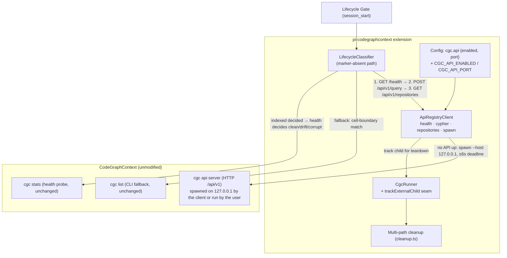

## Context

The classifier (design D2 of add-cgc-session-lifecycle-gate) resolves indexedness on the marker-absent path via `cgc list` (merged fix, commit e23643e). That works but costs a full CLI spawn and parses a rendered table with a cell-boundary match. CGC also exposes an HTTP API — `cgc api start`, endpoints under `/api/v1` — whose `POST /api/v1/query` runs `execute_cypher_query` (read-only-guarded) against the live graph on every supported backend (Neo4j, FalkorDB Lite/Remote, Kuzu embedded). `Repository` nodes carry a UNIQUE constraint + INDEX on `r.path`, so `MATCH (r:Repository {path: $path}) RETURN r LIMIT 1` is an indexed O(1) point lookup with exact path semantics. Verified port-conflict behavior: `cgc api start` exits with code 3 on `EADDRINUSE`.

Standing contracts this change operates under: ADR-0001 (wrap-only binary integration; only exit codes and coarse output markers are parsed; uncertainty is corrupt-adjacent), ADR-0002 (readiness-gated, non-configurable guidance — unaffected), ADR-0005 (output policy — the API path captures no CLI output, so the pipeline is not involved), and the fail-safe doctrine (never map uncertainty to `drift`; never act destructively; every probe bounded).

## Goals / Non-Goals

**Goals:**

- Faster, more precise indexedness resolution on the marker-absent path: indexed Cypher point lookup over HTTP beats a CLI spawn, and exact JSON/record matching beats table-cell parsing.
- Full preservation of the `cgc list` fallback and the outcome doctrine — the API path is a strictly layered optimization.
- Loopback-only spawning, explicit auth-key handling, hard-bounded time budgets, and zero orphans.

**Non-Goals:**

- No new tools, no graph-query surface for the agent (ADR-0001: the CGC MCP server remains the query engine; the API here is a classifier-internal gate probe only).
- No changes to the marker-present path, the health probe (`cgc stats`), or any notice/state rendering.
- No CGC modifications; no persistent state beyond the per-session caches that already exist.
- No agent-guide changes: gate internals, not agent-facing routing.

## Decisions

### D1: Layered probe chain, API first, CLI list unchanged as fallback

**Decision:** On the marker-absent path, in order: (1) `GET /health` (500 ms cap) on the configured port — if up, `POST /api/v1/query` with the point lookup (5 s cap); (2) on an unexpected query ERROR (not a clean found/absent), `GET /api/v1/repositories` and match the cwd against the parsed JSON values; (3) if no API is reachable, spawn one (D2); (4) if the API path fails overall (budget expired, no healthy server, unreachable), run the existing `cgc list` probe unchanged. The marker-present path never reaches any of this.

**Rationale:** Each step is cheaper or more precise than the next; the CLI fallback keeps the merged fix's behavior as the guaranteed floor. The repositories-JSON fallback runs only on genuine query errors — a clean found/absent is authoritative (indexed point lookup) and needs no second opinion.

**Alternatives considered:**

- *Replace `cgc list` entirely* — rejected: removes the working fallback and re-couples indexedness to a single transport.
- *Try the API only when `cgc list` is inconclusive* — rejected: that wastes the CLI spawn on the common path instead of saving it.

### D2: On-demand spawn with hard deadline, then give up to the CLI

**Decision:** When `/health` is down on the configured port, spawn `cgc api start --host 127.0.0.1 --port <port>` with `CGC_API_KEY=<key>` in its environment. Attempt the configured port first, then random ephemeral ports (49152–65535) per retry. After each spawn, poll `GET /health` on that port at a 200 ms interval. A child that exits with code 3 (bind conflict) or whose health poll fails triggers the next attempt. The WHOLE spawn phase runs under a 6 000 ms monotonic hard deadline (injectable clock); on expiry any still-running spawned child is terminated and the API path reports failure, falling through to `cgc list`. A spawned server that comes healthy is used for the Cypher lookup and terminated once the probe resolves — the extension does not keep a server it spawned alive after the gate answered.

**Rationale:** The spawn phase must never make the classifier slow or unbounded — 6 s total, once per workspace per session (cached). Terminating our own spawned server after the lookup avoids holding a bound port and a Python process for the session's lifetime; the gate answers indexedness, it does not operate a service. Servers the USER was already running (health-up on the first check) are never touched.

**Alternatives considered:**

- *Keep the spawned server running for the session* — rejected: the classifier is the only consumer; an idle loopback daemon per unindexed-ish workspace is orphan-risk without benefit.
- *Unbounded retries* — rejected: violates the bounded-probe doctrine.
- *Spawn without `--host`* — rejected: CGC defaults to `0.0.0.0` (network-exposed); we always pass `127.0.0.1`.

### D3: Security model — pass-through or ephemeral key, loopback only

**Decision:** If `process.env.CGC_API_KEY` is set, it is passed through untouched and sent on every request (`Authorization: Bearer <key>` plus `X-API-Key: <key>`; CGC accepts either). Otherwise the client generates a random ephemeral key (`crypto.randomUUID()`), hands it to the spawned server via its environment, and sends it on requests. Spawned servers ALWAYS get `--host 127.0.0.1`. The key is never logged, never written to disk, and never appears in reasons/messages.

**Rationale:** An unauthenticated default API on loopback is low risk, but the extension may spawn a server itself — authenticating our own spawn costs one `randomUUID()` and closes the "local process talks to our server" hole without configuration. The ephemeral key also prevents the extension's probe from racing a user-configured authenticated server it cannot talk to.

**Alternatives considered:**

- *Never send auth (rely on default-unauthenticated)* — rejected: breaks against `CGC_API_KEY`-secured deployments exactly when the pass-through case matters.
- *Generate a key always and ignore the user's* — rejected: the user's key is the credential their own server expects; generating a different one would fail the health/query calls against it.

### D4: Teardown — external children join the runner's existing sweeps

**Decision:** `CgcRunner` gains a narrow `trackExternalChild(child)` seam: the spawned API server is registered in the runner's existing `liveChildren` set, so every teardown path (`session_shutdown` → `killAll()`, `process` `exit` / signals → `terminateAllSync()`) sweeps it together with every other cgc child. The client additionally terminates its own spawned server when the probe resolves (success or budget expiry), which unregisters it. No new cleanup path is invented.

**Rationale:** Reuses the proven three-path teardown guarantee (cleanup.ts) instead of a parallel registry; "no orphans" becomes a property of the existing guarantee.

**Alternatives considered:**

- *A separate process registry inside api-registry.ts with its own hooks* — rejected: duplicates cleanup logic and would miss the exit/signal paths unless reimplemented.
- *Spawn the server through `CgcRunner.run`* — rejected: `run` awaits command completion with a time budget; a long-lived server would always be killed by its own budget mid-flight.

### D5: Config surface — `cgc.api` with the established layering

**Decision:** `cgc.api: { enabled: true, port: 8000 }`. Keys `cgc.api.enabled` / `cgc.api.port` join `ConfigKey`; env overrides `CGC_API_ENABLED` (the shared lenient boolean convention) and `CGC_API_PORT` (integer 1–65535, else warning + fallback). Defaults sit in `DEFAULT_CONFIG`; both file and env layers parse them like every other key.

**Rationale:** Follows the existing config shape (nested section, `CONFIG_ENV_VARS` table, warning-and-fallback validation) exactly; `enabled: true` default mirrors `tools.cliGap.enabled` — the API path is pure optimization with a CLI fallback, so opt-out is the escape hatch rather than opt-in.

**Alternatives considered:**

- *Default off* — rejected: the probe is read-only, loopback, bounded, and falls back safely; default-off would silently keep the slower path for everyone who never reads docs.
- *Expose host in config* — rejected: host is always `127.0.0.1` by security decision (D3); a configurable host would invite a network-exposed spawn.

### D6: Doctrine mapping is untouched — the decider is only named

**Decision:** The API probe's outcomes map exactly like the CLI probe's: found → indexed → the existing `cgc stats` health probe decides clean/drift/corrupt; absent → `unindexed` notice; any failure after the CLI fallback → BUSY keeps `busy`, everything else is corrupt-adjacent unknown. Reasons prefix the decider: `registry (cypher)` for API-decided outcomes, `registry (cgc list)` (keeping the existing `registry override` wording) for CLI-decided ones.

**Rationale:** The doctrine (never drift on uncertainty, never destructive on unknown) is orthogonal to which transport answered indexedness; naming the decider keeps diagnostics honest without changing behavior.

### D7: Injectable seams, not a live server in tests

**Decision:** `ApiRegistryClient` takes injectable `fetch`, spawn, clock (`() => number`), delay, and key-source functions. All HTTP timeouts ride `AbortSignal.timeout`; the 6 s spawn deadline is measured on the injected monotonic clock. Tests drive the client with fake fetch/spawn/ChildProcess-like stand-ins and a fake clock — no real `cgc api start`, no real ports.

**Rationale:** Deterministic tests for exit-3 retries and deadline expiry require controllable time and process lifetimes; the seams are the same pattern the runner uses (`outputPolicy`, spill base dir).

### Architecture (C4 — component level)

## Risks / Trade-offs

- [The spawned API server is a Python process the extension did not use to spawn] → Loopback-only bind, ephemeral key, hard 6 s deadline, terminated after the probe resolves, and registered for every teardown path (D2/D3/D4). Worst case is one bounded, loopback-bound, authenticated child that dies with the session.
- [A port conflict storm (many attempts) wastes time] → Bounded by the 6 s deadline; exit code 3 skips to the next port immediately; total cost is once per workspace per session (per-session cache).
- [CGC API response shapes drift across versions] → Parsing stays coarse: records arrays / JSON string values with exact-path matching; any unparseable outcome is a query ERROR → repositories fallback → CLI fallback → doctrine fail-safe. No deep schema coupling.
- [The API server is up but the query errors on every call] → The repositories-JSON fallback and then `cgc list` decide; behavior never depends on a single transport.
- [User's own API server on a non-configured port] → The configured-port health check misses it; the spawn phase answers instead. A future `cgc.api.port` config value covers non-default setups.
- [Ephemeral key races a user server requiring THEIR key] → If `CGC_API_KEY` is set it is passed through (D3); if the user secured their server with a key not in the extension's environment, health fails and the CLI fallback decides — the doctrine absorbs it.

## Migration Plan

- No migration. The change is additive on the marker-absent path; rollback = `cgc.api.enabled: false` (or `CGC_API_ENABLED=0`), which restores the merged fix's exact behavior. The `cgc list` fallback and all doctrine are unchanged.

## Open Questions

- None blocking. (Default-on for `cgc.api.enabled` mirrors `tools.cliGap.enabled`'s recorded precedent; the fail-safe fallback makes either default behaviorally safe.)
