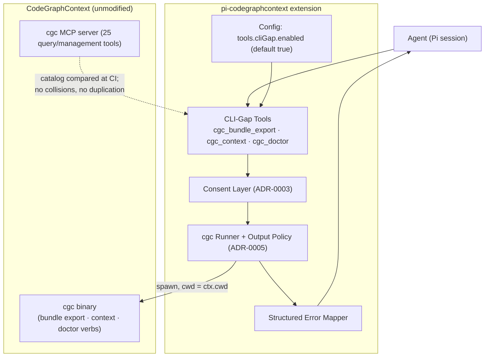

## Context

The benefit analysis and the user's scope decision restored this feature: the CGC MCP server's 25-tool catalog lacks bundle **export** (it loads/searches bundles only), named-context **management** (it discovers/switches but cannot create/delete/set-default), and **diagnostics** (no doctor equivalent). These verbs are CLI-only today. This is the campaign's only tool-registering change, and it sits under three in-force contracts: ADR-0001 (wrap-only integration through the shared runner), ADR-0003 (consent model for destructive/file-writing actions), and ADR-0005 (all wrapped output passes the policy pipeline). The user's recorded lean is "opt-out (enabled by default)", explicitly marked as not-final — flagged as an open question below.

## Goals / Non-Goals

**Goals:**

- Three curated tools — `cgc_bundle_export`, `cgc_context`, `cgc_doctor` — closing exactly the MCP catalog's management gaps, with zero graph-query duplication.
- Structured, agent-actionable errors (normalized codes + remediation hints) so tool failures guide recovery instead of dead-ending the agent.
- Full inheritance of the shared guardrails: runner safety, output policy, consent layer, sandbox preservation.

**Non-Goals:**

- No generic `cgc` passthrough tool (per-verb consent and argument validation are the point; a passthrough would bypass both).
- No graph query tools (impact-before-edit / blast-radius remain deferred, recorded in the slash-commands proposal).
- No bundling of the MCP server (deferred, recorded in the lifecycle-gate proposal).
- No exposure of `ALLOW_DB_DELETION`-gated verbs, ever, and never setting or bypassing that configuration.

## Decisions

### D1: Curated three-tool surface, not a passthrough

**Decision:** Exactly three tools with fixed, validated argument shapes; each maps to documented CLI verbs.

**Rationale:** A passthrough would violate the per-verb consent model (ADR-0003), evade argument validation, and create an unbounded security surface; three named tools keep schemas inspectable and testable.

**Alternatives considered:**

- *Single `cgc_run` escape-hatch tool* — rejected: shell-equivalent risk, bypasses consent, unreviewable.
- *One combined `cgc_admin` tool with subactions* — rejected: conflates consent classes (export writes files; delete mutates config; doctor is read-only) into one schema.

### D2: Default-on with opt-out — decision recorded, flag kept open

**Decision:** `tools.cliGap.enabled` defaults to true; disabling removes all three tools from the catalog.

**Rationale:** These verbs have no MCP alternative, so default-off would hide the feature from everyone who didn't read docs — the opposite failure of the one the opt-out exists for. The user's lean supports default-on but was explicitly marked not-final; the open question below keeps this reversible before apply.

**Alternatives considered:**

- *Opt-in (default off)* — rejected for now per the user's lean; revisitable at proposal review.
- *Per-tool flags* — rejected: three knobs for one coherent capability adds config surface without a use case; the whole set is small and safe by construction.

### D3: Consent classes map to ADR-0003 exactly

**Decision:** `cgc_bundle_export` (file write) and context `delete` (config mutation) require explicit confirmation; `list`, `create`, and `default`-set run without confirmation; no tool touches deletion-safety-gated operations.

**Rationale:** Reuses the single consent layer rather than inventing tool-specific rules; matches CGC's own semantics (context delete preserves database files, so it is registration-level mutation).

**Alternatives considered:**

- *Confirm everything* — rejected: read-only/list operations would train reflexive approval.
- *Never confirm (tools are "just CLI")* — rejected: contradicts ADR-0003's file-write and mutation rules.

### D4: Structured error contract

**Decision:** Every failure returns a normalized code (`NOT_FOUND`, `NOT_ALLOWED`, `BUSY`, `TIMEOUT`, `COMMAND_FAILED`, `UNAVAILABLE`) with a one-line remediation hint and a bounded stderr tail — the recon-confirmed agent-actionable error pattern.

**Rationale:** Raw tracebacks dead-end agents; structured codes let the model self-correct (e.g., `NOT_ALLOWED` → inform user about allowed roots).

**Alternatives considered:**

- *Pass through raw CLI stderr* — rejected: noisy, unbounded, non-actionable.

### D5: Deprecation path when MCP catches up

**Decision:** If a future CGC MCP release adds an equivalent tool, the corresponding extension tool is removed in favor of the MCP one; a test asserts no name/behavior collision so drift is caught at CI time.

**Rationale:** The extension's tools exist only because of a catalog gap; when the gap closes, duplication becomes tool-selection burden — the exact anti-pattern the campaign avoids.

**Alternatives considered:**

- *Keep both indefinitely* — rejected: duplicative tool surface confuses selection and violates the no-duplication requirement.

### Architecture (C4 — component level)

## Risks / Trade-offs

- [CGC CLI verb flags drift across versions] -> Tools map to stable, documented verbs (`bundle export`, `context`, `doctor`); unsupported-flag failures surface as structured `COMMAND_FAILED` with the CLI's own hint; supported CGC version range pinned.
- [A future MCP release duplicates these verbs] -> D5's deprecation path plus the CI collision test make retirement mechanical rather than debated.
- [Agent requests export of sensitive repositories] -> Confirmation names the output path (ADR-0003); output itself passes redaction before returning; sandbox semantics remain CGC-enforced.
- [Default-on surprises users who want a minimal tool surface] -> Single opt-out flag documented in the proposal and README; open question kept open for the user to flip the default before apply.
- [Context default-set changes behavior of future sessions] -> Documented in the tool description; list results show the current default so the change is visible.

## Migration Plan

- No migration. Rollback = disable the extension or set `tools.cliGap.enabled=false` (tools disappear; no persistent state beyond CGC's own).

## Open Questions

- **Tool default (flagged for user confirmation at review):** opt-out (enabled by default, current recorded decision) vs opt-in (disabled by default). The user leaned opt-out but marked the choice not-final.
- None blocking otherwise.
