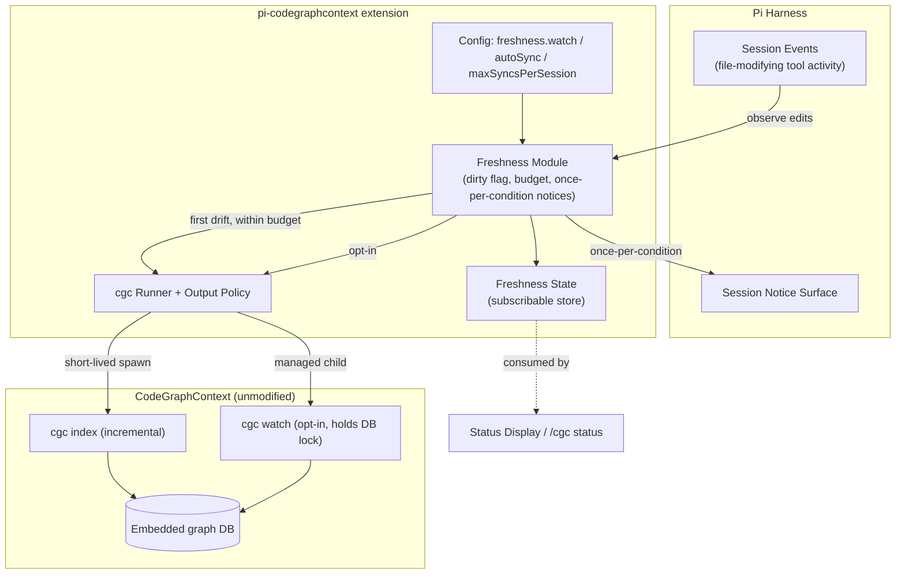

## Context

This is the second bedrock change (with `add-cgc-session-lifecycle-gate`): the gate guarantees a fresh-enough graph at session start, and this capability keeps the freshness story honest for the rest of the session. Two CGC facts shape the design: CGC ships its own incremental machinery — a watchdog-based watcher (`cgc watch`) with optional `--sync-on-start` reconciliation, and `cgc index` is incremental by default — and both the watcher and any index run hold the single-process embedded database, meaning a continuously-running watcher would lock out the user's own CGC MCP server for the whole session. Reference extensions confirm the harness-side pattern: observe the session's own edit activity as the drift signal (content-hash baselines or tool-event observation), keep staleness advisory (flags, notices), and never block the loop on sync.

In-force ADRs: `adr/0001` (wrap-only runner, skip-as-busy, multi-path teardown), `adr/0002` (agent-context writes only via the guidance contract), `adr/0003` (consent — no new destructive actions here), `adr/0004` (passive renderers — this module is a state maintainer, not a renderer, but its notices follow the same once-per-condition discipline), `adr/0005` (output policy — sync output flows through the pipeline), `adr/0006` (no new tools — freshness is not agent-invoked).

## Goals / Non-Goals

**Goals:**

- Honest freshness: the state never claims fresh after observed edits until a sync completes.
- Detection without cost: drift observed from the session's own edit events — zero detection spawns, no hashing, no polling.
- Conservative self-healing: one background incremental index on first drift (budgeted), busy-skips visible, watcher available but never the default.
- Clean handoff: freshness state is a subscribable store that the status display and `/cgc status` render when present.

**Non-Goals:**

- No agent-facing injection: per-turn drift steers and result annotations are the proactive-injection change's opt-in contract; this change produces only state and human notices.
- No filesystem watching by the extension itself: drift detection is event-based; continuous watching is CGC's watcher, managed and opt-in.
- No accuracy claims beyond "possibly stale": the conservative dirty flag does not identify which files changed (CGC's incremental index handles the actual file set).
- No cross-workspace freshness: the active session workspace only.

## Decisions

### D1: Drift is observed from session edit events, not from the filesystem

**Decision:** The module subscribes to Pi's documented `tool_call` event (fired with `event.toolName` and typed `event.input`; complemented by `tool_execution_start`/`tool_execution_end`) and marks the workspace possibly-stale on the first observed file-modifying tool call, debouncing bursts. Pi documents no file-specific "file edited" event — tool-call interception is the available, conservative signal.

**Rationale:** Zero detection cost, no lock exposure, no duplication of CGC's file discovery; a conservative over-approximation is acceptable because staleness is advisory and CGC's incremental index computes the real file set.

**Alternatives considered:**

- *Extension-owned fs watcher (chokidar-style)* — rejected: duplicates what CGC's watcher already does, adds a second watcher process, and spends effort hashing files CGC will re-hash anyway.
- *Hash-based diffing* — rejected: expensive, and precision is unnecessary for an advisory flag.

### D2: Lazy re-index is the default; continuous watcher is opt-in — because of lock dominance

**Decision:** Default mode runs at most `freshness.maxSyncsPerSession` short-lived incremental indexes (first-drift trigger), deduplicated through the runner. `cgc watch` is supported via `freshness.watch` (default false) as a managed child process.

**Rationale:** A continuous watcher holds the embedded database for its whole lifetime — in the dominant real-world setup (user's CGC MCP server answering queries), it would busy-skip every MCP query. Short-lived indexes only occupy the lock briefly, and the runner's busy-skip makes contention visible instead of harmful.

**Alternatives considered:**

- *Watcher by default* — rejected: trades the user's MCP availability for freshness they did not ask for.
- *Never support the watcher* — rejected: some users run no MCP server and prefer continuous freshness; the lock trade-off is theirs to make.

### D3: The sync budget exists to bound churn

**Decision:** Auto-syncs are capped per session (default 2). After the budget, further drift only refreshes the advisory stale condition and notices; `/cgc sync` (add-cgc-slash-commands) remains available for explicit on-demand syncs.

**Rationale:** Each sync is a full incremental pass; without a cap, an editing-heavy session would spawn a sync per burst. The cap keeps the feature cheap while `/cgc sync` preserves control.

**Alternatives considered:**

- *Unlimited auto-syncs* — rejected: unbounded spawns on chatty sessions.
- *Time-based cooldown only* — rejected: still unbounded in aggregate; the hard cap gives a guarantee.

### D4: Notices are human-facing, once per condition — state is the machine-readable layer

**Decision:** Staleness/skipped/completed conditions surface through the session notice surface at most once per condition per session — three condition keys total (possibly-stale, skipped-busy, sync-completed). The watcher-start-blocked-by-lock notice fires under the same `skipped-busy` condition key as the lazy-sync busy skip, so it shares that key's once-per-session budget rather than adding a fourth condition. The freshness state store is the data layer other surfaces consume; the module writes nothing to the agent context.

**Rationale:** Consistent with ADR-0004's warning discipline and ADR-0002's boundary: anything agent-visible must go through the guidance/injection contracts, which the proactive-injection change (opt-in) will build on this state.

**Alternatives considered:**

- *Emit a steer to the agent when stale* — rejected: agent-intrusive; belongs to the opt-in proactive change.
- *Silent state only* — rejected: humans need the stale signal even when they never open `/cgc status`.

### D5: Freshness state is a small subscribable store

**Decision:** The module exposes `{fresh | possibly-stale | syncing | skipped-busy | disabled}` plus timestamps, with change subscriptions — the same pattern the lifecycle state uses.

**Rationale:** One shape for all state consumers (HUD, status command, future proactive injection); rendering and state stay separated per ADR-0004.

### Architecture (C4 — component level)

## Risks / Trade-offs

- [Edit events miss external changes (files changed outside the session)] -> Accepted, documented gap: the conservative flag only tracks session-observed activity; external drift is caught at the next session start by the gate's start-time sync; `/cgc sync` covers the interim on demand.
- [Sync contends with the user's MCP server] -> Short-lived indexes plus runner dedup and skip-as-busy keep the lock window small and visible; watcher mode (the risky case) is opt-in with the trade-off documented.
- [Burst edits cause event storms] -> Dirty marking is debounced; the sync budget bounds spawns regardless of storm size.
- [Staleness is advisory and can be wrong in both directions] -> By design: over-approximation (possibly-stale when clean) costs one cheap sync; under-approximation is bounded by the documented external-edit gap.
- [Notices annoy] -> Once-per-condition-per-session, three condition keys total (possibly-stale, skipped-busy, sync-completed), each with an actionable hint (`/cgc sync`); the watcher-locked busy notice fires under the shared skipped-busy key.

## Migration Plan

- No migration. Rollback = disable the extension or `freshness.autoSync=false` (state and notices disappear; start-time sync from the add-cgc-session-lifecycle-gate change still runs).
- Downstream consumers (HUD, `/cgc status`) already specify degradation when this capability is absent.

## Open Questions

- Resolved during validation: the drift-observation event is pinned as `tool_call` (with `toolName`/`input`; complements `tool_execution_start`/`end`) per installed `docs/extensions.md` — no file-specific event exists, and tool-call interception satisfies the conservative requirement (validator finding for task 1.3 in validate.md).
- None blocking otherwise.
