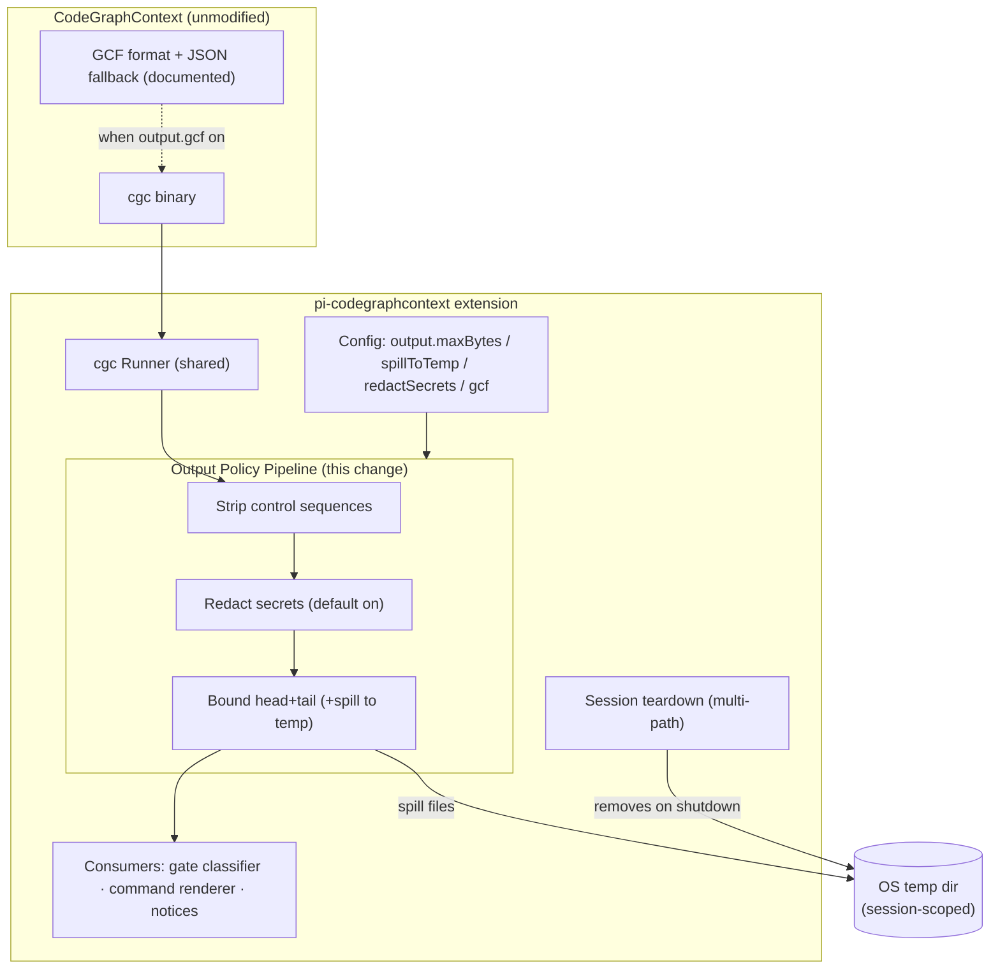

## Context

The shared runner (ADR-0001) captures output from every wrapped `cgc` invocation; today that capture is "bounded" only as an implementation detail, and change 3's renderer anticipated a shared bounding policy it could consume. CGC's CLI emits terminal-rich, potentially secret-bearing output: CGC documents `REDACT_SECRETS` for bundle contents (node properties from indexed source) but CLI output is not redacted, and CGC documents an opt-in GCF output format (`CGC_OUTPUT_FORMAT=gcf`, ~62% smaller tool responses, JSON fallback when `gcf-python` is absent). Reference extensions converge on the same output hygiene: head+tail truncation with explicit markers (isac322 keeps both ends), secret redaction in diagnostics, and bounded sizes everywhere.

In-force ADRs: `adr/0001` (wrap-only, fail-open runner), `adr/0002` (agent-context writes only via the guidance contract), `adr/0003` (consent model), `adr/0004` (passive renderers). This change modifies the runner's capture pipeline — it introduces no spawns, no agent-context content, and no new surfaces.

## Goals / Non-Goals

**Goals:**

- One policy pipeline in the runner — strip → redact → bound (+spill) — through which every current and future surface's output flows.
- Token economy with diagnostic fidelity: head+tail preservation, explicit markers, full-output spill for anything truncated.
- Secret hygiene by default: captured output is redacted before any human or agent sees it.
- Opt-in GCF passthrough aligned with CGC's documented behavior and fallback.

**Non-Goals:**

- No changes to CGC, the MCP server's output, or MCP tool schemas (the MCP server has its own documented GCF opt-in; this policy governs only extension-wrapped CLI invocations).
- No semantic parsing of output beyond what earlier changes already do (exit codes and coarse markers) — the policy is format-agnostic.
- No new agent-context content: what surfaces choose to render/inject remains governed by ADR-0002 and the proactive-injection change.
- No workspace writes: spill files live in the OS temp directory only.

## Decisions

### D1: The policy is a pipeline stage inside the shared runner

**Decision:** Capture is restructured as a pipeline — strip control sequences → redact secrets → bound to budget with head+tail (+spill) — applied uniformly in the runner before results reach any consumer (gate classifier, command renderer, notices).

**Rationale:** A single choke point guarantees the spec's universality requirement and keeps change 3's renderer a pure consumer, as its design anticipated.

**Alternatives considered:**

- *Per-surface bounding at render time* — rejected: every surface would re-implement the policy and drift; also leaves raw (unredacted) output in memory-wide reach.
- *Bounding only the biggest commands* — rejected: probes and watchers can also emit large output; universality is the point.

### D2: Head+tail preservation with an explicit marker

**Decision:** Truncation keeps the first and last portions of the output with a marker stating the original size (and the spill path when enabled).

**Rationale:** CLI diagnostics typically carry summary information at both ends (command echo at the head, totals/errors at the tail); head-only truncation hides the tail where failures surface. This is the recon-confirmed pattern.

**Alternatives considered:**

- *Head-only truncation* — rejected: hides the summary/error tail.
- *Middle-ellipsis without sizes* — rejected: agents and users need the original size to judge what was lost.

### D3: Spill files are session-scoped, outside the workspace, and torn down with the session

**Decision:** On truncation (spill enabled), full output is written to a per-session directory under the OS temp location with restrictive permissions where supported; the marker names the path; the existing multi-path session cleanup (change 1's teardown) removes the directory.

**Rationale:** Keeps workspaces clean, bounds disk usage to the session lifetime, and reuses the proven cleanup paths instead of inventing new ones.

**Alternatives considered:**

- *In-workspace `.cgc/` spill directory* — rejected: pollutes the indexed tree and risks the spill content being indexed by CGC itself.
- *Persistent spill log* — rejected: unbounded growth and stale-path confusion; session scope matches the cleanup story.

### D4: Conservative, pattern-based redaction with an explicit opt-out

**Decision:** Redaction matches credential-style assignments (key/token/secret/password forms) and high-entropy literal candidates, replacing values with a placeholder; it runs before bounding so placeholders are what surfaces see. `output.redactSecrets` (default on) disables it when users prefer fidelity.

**Rationale:** CGC's own `REDACT_SECRETS` acknowledges source trees commonly carry hardcoded secrets; CLI output (doctor/report rendering file-adjacent content) can echo them. Patterns are conservative to limit false positives, and the opt-out keeps fidelity available — a recorded balance, with the default on the safe side.

**Alternatives considered:**

- *Non-disableable redaction* — rejected: false positives on legitimate content (e.g., documentation examples) would be unfixable without an escape hatch.
- *Redact only when `REDACT_SECRETS=true`* — rejected: that CGC flag governs bundle contents, not CLI output; tying the extension's default to it would silently disable protection.

### D5: GCF passthrough is config-driven with CGC's own fallback — no availability probes

**Decision:** When `output.gcf` is enabled, the runner simply sets `CGC_OUTPUT_FORMAT=gcf` on invocations; if `gcf-python` is missing, CGC's documented JSON fallback applies and the invocation succeeds.

**Rationale:** CGC documents the fallback explicitly, so probing availability would add a spawn for information CGC already handles — contradicting the passivity instincts of ADR-0004 and the invocation budget.

**Alternatives considered:**

- *Probe `gcf-python` availability once per session* — rejected: extra spawn for no behavioral gain; the fallback is designed-in by CGC.

### Architecture (C4 — component level)

## Risks / Trade-offs

- [Redaction false positives mangle legitimate output] -> Conservative pattern set, placeholder preserves shape, explicit opt-out documented; incidents are user-fixable without code changes.
- [Spill files hold secrets on disk] -> OS temp directory (never the workspace), restrictive permissions where supported, session-scoped lifetime, teardown cleanup on all paths; risk window equals the session.
- [GCF output confuses consumers expecting JSON] -> Opt-in (default off), documented target ("100% LLM comprehension on frontier models" per CGC), and consumers are the agent/user who opted in.
- [Truncation hides middle content] -> Head+tail plus spill gives both the summary ends and full fidelity on demand; marker states the original size so loss is visible.
- [Policy pipeline bugs eat good output] -> Fail-open requirement: any pipeline error degrades to best-effort delivery with the error recorded, never to a lost invocation.

## Migration Plan

- Change 3's renderer drops its ad-hoc bounding in favor of the shared policy (its design anticipated this); no data migration. Rollback = revert the runner pipeline (surfaces degrade to their previous behavior).
- Environment-variable overrides keep CI/headless use configurable without code changes.

## Open Questions

- None blocking. (Redaction pattern tuning is an implementation detail guided by the conservative-first principle; the opt-out is the designed pressure valve.)
