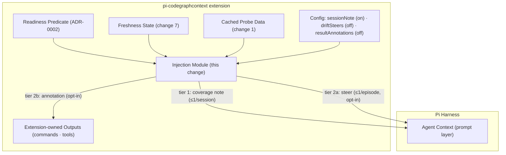

## Context

The campaign's pieces meet here: readiness (ADR-0001's lifecycle state), coverage data (the lifecycle probe's captured stats), staleness (ADR-0007's freshness state), and the delivery mechanism (ADR-0002's documented prompt-guideline surface). The project owner recorded the two-tier configuration split — session-start coverage note enabled by default with opt-out; drift steers and result annotations opt-in (disabled by default) — resolving the tension the reference research exposed: reference-extension experience suggests CKG's proactive injection proved valuable but is exactly the layer users ask to turn off, so the quiet default and the intrusive extras must carry different defaults.

Cross-change references below use the campaign's numbering: change 1 = `add-cgc-session-lifecycle-gate`, change 2 = `add-cgc-agent-routing-guidance`, change 7 = `add-cgc-freshness-drift-sync`, change 8 = `add-cgc-agent-guide`.

In-force ADRs: `adr/0001` (wrap-only runner), `adr/0002` (guidance contract: this capability is the sanctioned second writer of agent-visible content, reusing the readiness predicate and never bypassing non-configurability of the routing card), `adr/0003`–`adr/0006` (consent, renderers, output policy, tool boundary — untouched), `adr/0007` (freshness states are the trigger source for steers).

## Goals / Non-Goals

**Goals:**

- One capped paragraph of coverage facts in the agent's context at session start — by default, opt-out-able.
- Opt-in, episode-scoped drift steers and result annotations for users who want the agent kept actively informed.
- Strict composition: one readiness predicate, distinct content classes (coverage facts vs routing rules), no duplication, no new spawns.

**Non-Goals:**

- No interception of CGC MCP server results — by recorded decision: the documented `tool_result` event could patch their content, but annotating another surface's results is rejected as surprising; annotations scope to extension-owned outputs only.
- No per-turn maps or Fovea-style curation (deferred, recorded in the proposal).
- No new config surface beyond the three tier keys.
- No changes to the routing guideline card or its non-configurability.

## Decisions

### D1: Two tiers, two defaults — the recorded project decision

**Decision:** `proactive.sessionNote` (default true) governs the coverage note; `proactive.driftSteers` (default false) and `proactive.resultAnnotations` (default false) govern the agent-intrusive surfaces. Each key has an environment-variable override.

**Rationale:** The coverage note is quiet, bounded, and factual — safe to default on. Steers and annotations touch the agent repeatedly or alter perceived output — they must be deliberately chosen. This matches the owner's recorded split and the reference-extension lesson (proactivity is valuable until it is noise).

**Alternatives considered:**

- *Everything default-on* — rejected: unvalidated steer/annotation UX would be forced on every user.
- *Everything opt-in* — rejected: the coverage note is the cheap, high-value tier the owner explicitly defaulted on.

### D2: The coverage note is built from cached probe data only

**Decision:** The note renders from the lifecycle probe's already-captured data (repositories, languages, symbol counts when available, snapshot time, scope line) with a hard length cap; if counts are missing it degrades to a minimal presence-and-time note. Building it never spawns `cgc`.

**Rationale:** The probe already ran for readiness; a second spawn for content the note only paraphrases would violate the invocation budget and ADR-0004's passivity instincts.

**Alternatives considered:**

- *Fresh `cgc stats` at injection time* — rejected: a display-tier spawn, and the counts at session start barely differ from the probe's.
- *Rich multi-section coverage report* — rejected: prompt bloat; the guide (change 8) is the deep reference.

### D3: Steers are episode-scoped, driven by freshness transitions

**Decision:** A steer fires only on a fresh → possibly-stale transition (an "episode") and only when the tier is enabled; the next steer waits for the episode to resolve and re-open. The steer names the state and `/cgc sync`.

**Rationale:** Per-turn steering is the annoyance failure mode; per-episode steering carries the same information at a fraction of the interruptions.

**Alternatives considered:**

- *Steer on every turn while stale* — rejected: exactly the noise the tier's default-off exists to avoid.
- *Steer with staleness age (minutes) each turn* — rejected: same noise problem.

### D4: Annotations attach only to extension-owned outputs

**Decision:** Tier 2b appends one staleness line to outputs the extension itself produces (slash-command renders, CLI-gap tool results). CGC MCP server results are out of scope by recorded decision: the harness-documented `tool_result` event exists and could patch their content, but annotating another surface's results is rejected as surprising.

**Rationale:** Honest scoping: the annotation tier improves the surfaces the extension owns; MCP result annotation is technically available via the `tool_result` event but is rejected as a surprising surface for modifying another writer's output.

**Alternatives considered:**

- *Parse-and-annotate MCP SSE traffic* — rejected: protocol interception outside the extension's boundary; fragile and surprising.

### D5: One injection module, two content classes, shared gating

**Decision:** All tiers live in one injection module that consumes the readiness predicate (ADR-0002) and freshness state, exposes the three config keys, and emits through the documented prompt mechanism (guideline-class payloads) or output decoration (annotation class). Content classes are disjoint from the routing card by construction and by test.

**Rationale:** Single gating path, single fail-open story, and a structural duplication test keep the guidance contract intact while adding the second sanctioned content writer.

## Architecture (C4 — component level)

## Risks / Trade-offs

- [Coverage note grows past a paragraph] -> Hard length cap asserted by test; degradation path keeps it minimal when data is missing.
- [Snapshot time makes staleness visible but data stale] -> Intended: the note states when coverage was measured; freshness state carries the live judgment.
- [Steers interrupt at bad moments] -> Episode scoping plus default-off; steers are the user's explicit choice.
- [Annotations confuse tool-output consumers] -> One line, clearly delimited, semantics untouched; default-off.
- [Second content writer drifts toward routing content] -> Structural duplication test (tier content must not overlap the routing card) plus ADR-0002's follow-up rule.

## Migration Plan

- No migration. Rollback = disable the extension or set the three keys off (all tiers silent; readiness and freshness unaffected).

## Open Questions

- Exact stats fields captured by the lifecycle probe (pinned during implementation from change 1's probe output; the note degrades gracefully when absent).
- None blocking otherwise.
