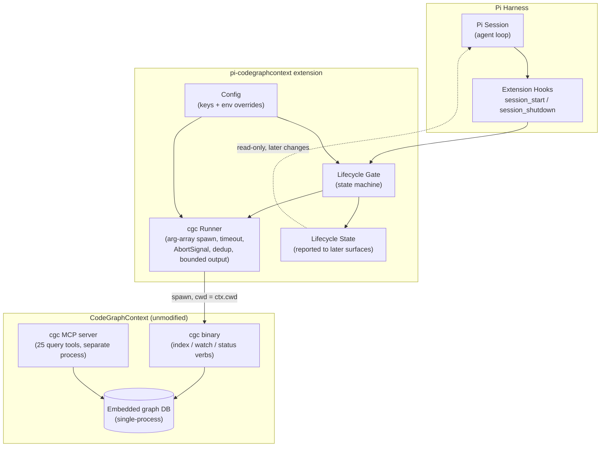

## Context

CodeGraphContext (CGC) ships an MCP server (25 query tools), a CLI (`cgc`), and embedded single-process graph backends (FalkorDB Lite default on Unix, KuzuDB fallback). The MCP server assumes an index already exists; nothing in the Pi harness today (a) creates one, (b) reconciles graph↔disk drift at session start, or (c) avoids lock collisions between concurrent `cgc` processes. The benefit analysis (10-feature ranked table) identified a session-start lifecycle gate as the bedrock feature: every other extension capability assumes "the index exists, is fresh, and no process is fighting over it."

Prior art studied in the reference-extension recon: independent Pi extensions converged on the same four lifecycle bugs — `process.cwd()` instead of session cwd, zombie subprocesses, eager startup, and prompt injection before tools are ready. This design builds the fixes in from day one.

Existing ADRs: `<repo>/adr/` does not exist yet; there are no in-force ADRs constraining this design. This design produces the first ones.

## Goals / Non-Goals

**Goals:**

- At `session_start`, guarantee the workspace's CGC index is detected, and — with consent where required — created, synced, or flagged, without blocking the agent loop.
- Treat `cgc` as the only integration surface: spawn the binary, never mutate CGC internals, never duplicate MCP query tools.
- Be a safe tenant of the single-process embedded backends: detect locks and skip as busy instead of forcing.
- Provide a reusable foundation (state machine + command runner + config) for the downstream changes in this campaign (freshness sync, status HUD, worktree contexts, CLI-gap tools).

**Non-Goals:**

- No graph query tools are registered by this extension (the CGC MCP server remains the query engine — confirmed boundary).
- No runtime/post-edit freshness tracking or staleness notices (owned by `add-cgc-freshness-drift-sync`); this change covers start-time drift only.
- No human-facing slash commands or HUD rendering (owned by `add-cgc-slash-commands` / `add-cgc-status-hud`); this change only exposes internal state that those surfaces will render.
- No worktree-specific resolution (owned by `add-cgc-worktree-aware-contexts`).
- No modifications to the CodeGraphContext repository.

## Decisions

### D1: Integrate exclusively by spawning the `cgc` binary

**Decision:** All CGC interaction goes through a single command runner that spawns `cgc` with an argument array (never a shell string), a per-command time budget, an `AbortSignal`, bounded output capture, and in-flight deduplication per workspace.

**Alternatives considered:**

- *Embed an MCP client in the extension wrapping `cgc mcp start`* — rejected: duplicates the query-engine boundary decision, adds a second long-lived process per session, and the maintenance verbs needed here (index/sync/status) are CLI-native.
- *Shell-string execution* — rejected: injection risk and non-portable quoting; argument-array spawn with an explicit `cwd` is the recon-confirmed safe pattern.
- *Importing CGC as a Python library* — rejected: wrong runtime (extension is TypeScript), and would couple the extension to CGC internals, violating the wrap-only rule.

### D2: A five-state lifecycle state machine driven by cheap detection

**Decision:** The gate classifies the workspace into `unavailable` (no `cgc` binary), `unindexed`, `busy` (lock held by another CGC process), `corrupt`, or `clean`/`drift`, using (1) filesystem detection of `.codegraphcontext/` and (2) a bounded `cgc` status/stats probe. Transitions:

```
unavailable ──(one-time notice)──■
unindexed ──(consent gate)──► indexing ──► clean | corrupt
drift ──► syncing ──► clean | corrupt
corrupt ──(explicit confirm)──► rebuilding ──► clean
busy ──(skip, one-time notice)──■
```

**Rationale:** Filesystem detection is free and lock-free; the `cgc` probe is needed only to distinguish clean/drift/corrupt, so it runs once per session and is cached. Classification errors fail toward "do nothing" rather than destructive action.

**Alternatives considered:**

- *Always run `cgc index .` and let CGC's skip-guard decide* — rejected: it can still contend for locks and hides state from the rest of the extension.
- *Parse CGC logs for state* — rejected: log formats are internal and drift-prone.

### D3: Fail-open, fire-and-forget gate on `session_start`

**Decision:** The gate runs asynchronously off the session-start path; every hook body is try/catch-guarded; failures are recorded into state and surfaced once. Auto-creation of a new index is opt-in (config, default off); drift sync for an existing index runs automatically; rebuild requires explicit confirmation.

**Rationale:** Matches the recon-confirmed failure mode where eager, blocking extension work degrades every session, and where failing spawns repeat per turn. A one-shot-per-session retry cap prevents hot loops.

**Alternatives considered:**

- *Blocking pre-flight with a spinner* — rejected: violates fail-open; slow `cgc doctor`-class probes would delay every session.
- *Fully manual (no gate)* — rejected: this is precisely the gap the extension exists to close.

### D4: Skip-as-busy is the only lock policy

**Decision:** When a maintenance command fails due to an embedded-backend lock (or a probe shows another CGC process owns the DB), the gate records `busy`, surfaces a one-time notice, and takes no further action that session. It never retries the command, never force-terminates the other process, and never deletes lock files.

**Rationale:** Embedded backends are single-process by design (CGC troubleshooting docs treat lock errors as expected behavior, not bugs). Retrying would only burn the command budget.

**Alternatives considered:**

- *Stale-lock detection and reclamation* — deferred: correct stale-lock identification needs process-liveness evidence; revisit only if busy-skips prove common in practice (Open Questions).
- *Queue behind the lock* — rejected: unbounded wait inside a session is worse than a visible skip.

### D5: Extension configuration surface (minimum viable)

**Decision:** Config keys: `cgc.executable` (default `cgc` on `PATH`), `cgc.timeoutMs` (default 30 000; version probe 10 000), `lifecycle.autoCreate` (default `false`), `lifecycle.syncOnStart` (default `true` when an index exists). All keys have environment-variable overrides for headless/CI use.

**Rationale:** Mirrors the recon insight that env-overridable config enables non-interactive use, while keeping the default posture safe (never create without consent).

### Architecture (C4 — component level)



The dashed read path is deliberately inert in this change: state is produced but only consumed by later changes (status HUD, slash commands). The MCP server and the extension's `cgc` spawns are peers that share the embedded DB — which is why D4 exists.

## Risks / Trade-offs

- [CGC CLI output format drifts between versions] -> Parse only exit codes and coarse markers; cap captured output; treat unparseable output as `corrupt`-adjacent "unknown" that fails safe; pin a supported CGC version range in the package metadata.
- [Probe commands contend for the embedded DB] -> Probes are read-only, time-boxed, run once per session, and deduplicated; any lock error maps to `busy`, never to a retry.
- [Background sync rewrites the graph while the user's MCP server holds it] -> The busy-skip path is the designed outcome; the one-time notice names the situation so the user can stop the watcher or defer sync.
- [Windows portability of process discovery] -> Spawn via explicit executable path with PowerShell-compatible discovery fallback (`Get-Command`), matching reference-extension practice; `busy` detection degrades to "lock error observed" if discovery is unavailable.
- [Gate work delays the agent despite fail-open design] -> Hard rule enforced in the runner: hook bodies never `await` `cgc` completion; all work is backgrounded with a per-session invocation budget.
- [Silent no-op confuses users ("is it doing anything?")] -> State is always queryable internally; the one-time notices and the later status-HUD change make the (in)action visible.

## Migration Plan

- New package; nothing to migrate. Rollback = remove/disable the extension (no persistent state beyond CGC's own).
- Load order safety: if downstream campaign changes are present but this gate is absent, they must degrade to manual mode — noted as a cross-change assumption, not implemented here.

## Open Questions

- None blocking for this change.
- Deferred (recorded in the proposal, owned by future changes): bundling the CGC MCP server with the extension distribution; runtime freshness/staleness behavior (`add-cgc-freshness-drift-sync`); stale-lock reclamation policy (see D4 alternatives) — revisit with real-world busy-frequency data.
