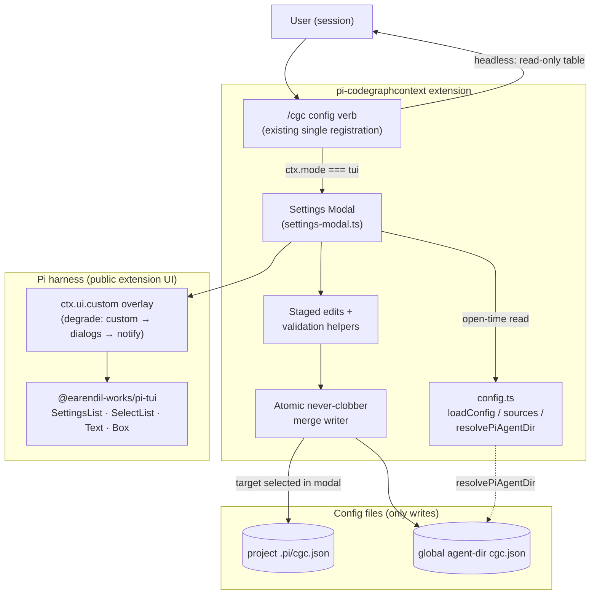

# Design: Add CGC Settings Modal

## Context

The extension already resolves configuration in `extensions/config.ts`: built-in defaults, then the global `<agent-dir>/cgc.json` (`resolvePiAgentDir`: `PI_CODING_AGENT_DIR` when set, else `~/.pi/agent`), then the project `.pi/cgc.json` (project wins per key), then env overrides (highest). `loadConfig` returns `ConfigResult` carrying `config`, `warnings`, and per-key `sources: Record<ConfigKey, ConfigSource>` where `ConfigSource` is `'default' | 'config-file' | 'env'` — the exact display surface the HUD needs.

Three verified constraints shape this design:

1. **pi has native interactive/modal UI for extension commands.** The installed `@earendil-works/pi-coding-agent` 0.85.x docs document, for extension commands: `ctx.ui.select/confirm/input/editor/notify` dialogs; `ctx.ui.custom<T>(factory, { overlay: true, overlayOptions, onHandle })` — "Overlay Mode (Experimental)", a floating modal over existing content with focus control; and the pi-tui components `SelectList` ("Pattern 1: Selection Dialog") and `SettingsList` with `getSettingsListTheme()` ("Pattern 3: Settings/Toggles" — value-cycling list with optional fuzzy search, including a worked `registerCommand("settings", …)` example). `docs/extensions.md` also documents the `ctx.mode === "tui"` guard for terminal-only features (`custom()`, terminal input).
2. **The reference implementation does not use a hidden pi API — it uses the same public primitives.** `spences10/my-pi` → `packages/pi-context/src/commands/context-command.ts` registers one command whose bare invocation opens `show_context_menu(ctx)`; `src/ui/menu.ts` and `src/ui/settings.ts` build picker/confirm/text/settings modals from the author's `@spences10/pi-tui-modal` package, whose `show.ts` wraps exactly `ctx.ui.custom<T>((tui, theme, _kb, done) => …)` with pi-tui `Box`/`SelectList`/`SettingsList`/`Text` plus a framed layout. Persistence in `packages/pi-context/src/config.ts` (`save_context_settings_config`) is a direct file write with atomic temp-file + `renameSync` (mode `0o600`), and `menu.ts` falls back to `ctx.ui.notify` when `ctx.hasUI` is false. So the `/context` pattern is reproducible with first-party pi surfaces alone.
3. **Config is captured at extension load; the cache is process-lifetime.** `extensions/index.ts` warms `getConfig()` (cached for the process lifetime) at load and constructs the long-lived components from captured values (`CgcRunner` gets `cgc.executable`, `cgc.timeoutMs`, `output.spillToTemp/redactSecrets/gcf`; the freshness observer gets `freshness.watch/autoSync/maxSyncsPerSession`; the injectors get `proactive.*` and `guidance.routingSkill`; CLI-gap tool registration branches on `tools.cliGap.enabled`). Rewriting the files mid-session therefore cannot retro-wire already-constructed components, and invalidating only the config cache would produce a half-applied hybrid state.

In-force ADRs reviewed: ADR-0001 (no query tools, wrap-only `cgc` — this change spawns nothing and registers no tools), ADR-0003 (confirmation-gated destructive actions — file-configuration edits are not destructive to indexes, but the never-clobber and refusal rules below are its spirit applied to config files), ADR-0004 (passive status renderers — the modal reads state on demand and performs no maintenance work).

## Goals / Non-Goals

**Goals:**

- One modal surface showing every `ConfigKey` with its effective value, source, and (for env) the winning env var name.
- Validated editing of every file-layer-writable key, using the same validation rules as `extensions/config.ts`.
- Layer-targeted, never-clobber persistence into project or global `cgc.json`.
- Honest effect semantics and graceful degradation in every non-TUI or failing condition.

**Non-Goals:**

- No live re-configuration of the running session (see D3).
- No editing of env-layer values or any file other than the two `cgc.json` targets; no env-var authoring helper (headless/CI users keep editing their environment).
- No new ADR: the decisions here are change-scoped interaction/persistence rules, not new cross-cutting principles; they inherit the existing ADR set.
- No `/cgc config get|set` machine interface: the modal is the human interface; the headless fallback is read-only display. (The agent already reads and edits the JSON files directly when asked.)

## Decisions

### D1: UI mechanism — native `ctx.ui.custom` overlay with pi-tui components; no third-party dependency

**Decision:** The modal is a `ctx.ui.custom()` component rendered with `{ overlay: true }` (experimental overlay mode), composing pi-tui `SettingsList` (boolean/enum cycling, fuzzy search), `SelectList` (the write-target selector and nested pickers), `Text`/`Box` (framing, titles, source annotations), and an in-modal text-input body for numeric/string keys. ESC closes; edits are staged in modal state and persisted on explicit save. Degradation chain, specified up front:

1. `{ overlay: true }` overlay modal (primary path).
2. If the overlay option is rejected or the overlay call throws — non-overlay `ctx.ui.custom()` (temporarily replaces the editor; same component).
3. If `ctx.ui.custom` itself is unavailable or throws — the documented dialog flow: `ctx.ui.select`/`ctx.ui.input`/`ctx.ui.confirm` step-by-step per key.
4. Outside the TUI (`ctx.mode !== "tui"` — `ctx.hasUI` is true in RPC and cannot gate, the guard pinned by add-cgc-status-hud) — no interactive UI at all: render the effective key/value/source table as a notice/annotation.

**Rationale:** Every step is a documented public surface of the installed pi version. Vendoring `@spences10/pi-tui-modal` (the reference's shared library) would add an external dependency for ~the same primitives we can hold directly, and would couple the extension to a fast-moving 0.0.x package; the framed-modal code we need is small and covered by the documented patterns. The degradation chain honors the overlay mode's "Experimental" status instead of betting the feature on it.

**Alternatives considered:**

- *Depend on `@spences10/pi-tui-modal`* — rejected: extra peer dependency, 0.0.x churn, and no behavior we cannot implement on documented primitives.
- *Plain `select`/`confirm` dialog flow only* — rejected as primary: the user asked for a modal HUD; dialogs remain only as the third fallback.
- *Checkpoint-bridge-style host relay (`ask_user_via_host`)* — rejected: that is a different mechanism for a different context (a bridge relaying to a host session), not pi's native in-TUI extension UI.

### D2: Write target and merge policy — per-session target selector, never-clobber atomic merge

**Decision:** A `SelectList` at the top of the modal chooses the write target for this modal session: **Project** (default; `<cwd>/.pi/cgc.json`) or **Global** (`resolvePiAgentDir(home)/cgc.json`, `PI_CODING_AGENT_DIR`-aware — reusing the shipped resolver). Saving applies all staged edits for the selected target in one atomic write:

- Read the target file if it exists. If it is missing, unreadable, or not a JSON object → refuse the whole save with a warning notice; nothing is written (for a missing file the modal offers creation of a fresh `{}` object after confirm).
- If a section the edits touch is present but not a plain object → refuse the save (config.ts already warns-and-skips such sections; silently replacing them would destroy user content).
- Apply only the edited nested keys into the parsed object (e.g. `cgc.api.port`); leave every other section, key, ordering, and unknown content untouched.
- Write atomically: temp file + rename, dir created `0o700` when needed, file mode `0o600` — the pi-context reference's persistence discipline.

**Rationale:** Project is the default because it is the layer the user is sitting in and it wins the layering for the active workspace; Global is one selector away for cross-project defaults. Never-clobber is the repo's existing config discipline (config.ts warns and skips malformed sections rather than normalizing them) extended to the write direction.

**Alternatives considered:**

- *Write the layer that currently wins each key* — rejected: surprising multi-file fan-out per save; the user should choose where a preference lives.
- *Whole-file regeneration from `DEFAULT_CONFIG`* — rejected: clobbers unknown keys, comments-adjacent structure, and future fields; exactly the failure mode the discipline forbids.

### D3: Immediate-effect semantics — honest next-session application, no partial cache invalidation

**Decision:** The modal reads its displayed values from a fresh `loadConfig()` at open time (not the process cache, so it reflects on-disk truth and `sources` accurately). After a successful save, the modal displays and the completion notice states: **changes take effect at the next session start; the running session keeps its current behavior.** No live re-wiring is attempted.

**Rationale:** `extensions/index.ts` captures config into long-lived components at extension load and `getConfig()` caches for the process lifetime, so "restart to apply" is the truthful contract. The rejected alternative — clearing `cachedConfig` after a write — would make freshly-read seams disagree with already-constructed ones (e.g. the runner's executable and timeouts vs. a re-read gate), producing a half-applied state that is harder to reason about than an explicit restart boundary.

**Alternatives considered:**

- *Invalidate `cachedConfig` after save* — rejected: mixed-state hazard above; the honest boundary is worth more than the convenience.
- *Construct every consumer via a live-config accessor to make edits hot* — rejected: an invasive refactor of the bedrock changes out of scope for a settings surface.

### D4: Validation mirrors `extensions/config.ts` exactly

**Decision:** Each editable key validates with the same rule its loader enforces, implemented as exported helpers next to the existing parsers (shared, not duplicated): booleans via `parseBoolean` semantics; `worktree.mode` ∈ {`off`, `isolate`}; `cgc.timeoutMs`/`cgc.versionProbeTimeoutMs` finite positive numbers (ms); `cgc.api.port` an integer 1–65535; `output.maxBytes` a positive whole number of bytes; `freshness.maxSyncsPerSession` a positive integer; `cgc.executable` a non-empty string. Invalid input is rejected inside the modal with the same message shape config.ts uses ("expected a TCP port between 1 and 65535", etc.) and never reaches the write path.

**Rationale:** One validation vocabulary prevents a save the loader would silently drop (config.ts skip-with-warning would make the HUD appear broken). Numeric keys accept string forms (`Number(raw)`), matching the file layer's lenient parsing.

### D5: Fail-open posture and read-only display rules

**Decision:**

- The verb is fail-open end to end, matching `commands.ts`' contract: any modal construction, UI call, or filesystem error degrades to a `notify` (bounded, severity-tagged) and the handler returns; it can never throw into or block the session.
- Keys whose `sources[key] === 'env'` are rendered read-only with the env var name from `CONFIG_ENV_VARS`; the modal does not offer edits it cannot make effective.
- Keys sourced from the file layer show which file won, so the user knows which target an edit must land in to take precedence (or that a project edit is shadowed by a global file value — the modal surfaces that relationship via the source annotation).
- Saves are all-or-nothing per target file (D2): no partial writes, no deletion of unknown content, ever.
- The modal registers no tools and spawns no processes (ADR-0001); its read paths perform no maintenance work (ADR-0004).

### D6: Command surface — `config` verb on the existing single `/cgc` registration

**Decision:** `/cgc config` opens the modal; `config` is added to `CGC_SUBCOMMANDS` and `getArgumentCompletions`. No separate top-level command is registered.

**Rationale:** pi parses extension-command invocations at the first space, so names containing a space can never be invoked and repeat registrations earn `:1` suffixes — the reason this extension has exactly one `registerCommand("cgc", …)`. A separate `/cgc-config` would work but fragments the family: bare `/cgc` usage text, completions, and documentation stay in one place. Bare `/cgc` in the TUI gains `config` in its usage listing; in headless mode `/cgc config` renders the read-only effective-config table.

### Architecture (C4 — component level)

## Risks / Trade-offs

- [Overlay mode is marked Experimental in pi's docs] -> Specified degradation chain (D1): non-overlay custom, then plain dialogs, then read-only notify; the feature never bets its core function on the experimental path.
- [User expects edits to apply to the running session] -> D3 makes the next-session boundary explicit in the modal and the completion notice; the alternative (cache invalidation) would silently half-apply.
- [A hand-edited target file contains unknown or malformed sections] -> D2 refuses to write rather than normalizing; config.ts's warn-and-skip semantics already tolerate such files on read.
- [Modal interaction complexity grows beyond a small HUD] -> Scope is fixed: every key is one of three interaction kinds (cycle / text input / read-only); no nested pages beyond the target selector; anything richer is a future change.
- [Env-overridden keys confuse users who edit files and see no change] -> The modal renders those keys read-only with the winning env var name, converting a silent no-op into an explanation.

## Migration Plan

- No migration. The verb is additive to the existing `/cgc` registration; rollback = revert the change (the two config files are untouched in format — the writer only edits keys the user edited).
- Headless and RPC sessions are unaffected: they get the read-only table (or nothing in JSON mode), never a modal.

## Open Questions

- None blocking. (Overlay-mode stability is the one watch item; D1's degradation chain already answers it for this change.)
