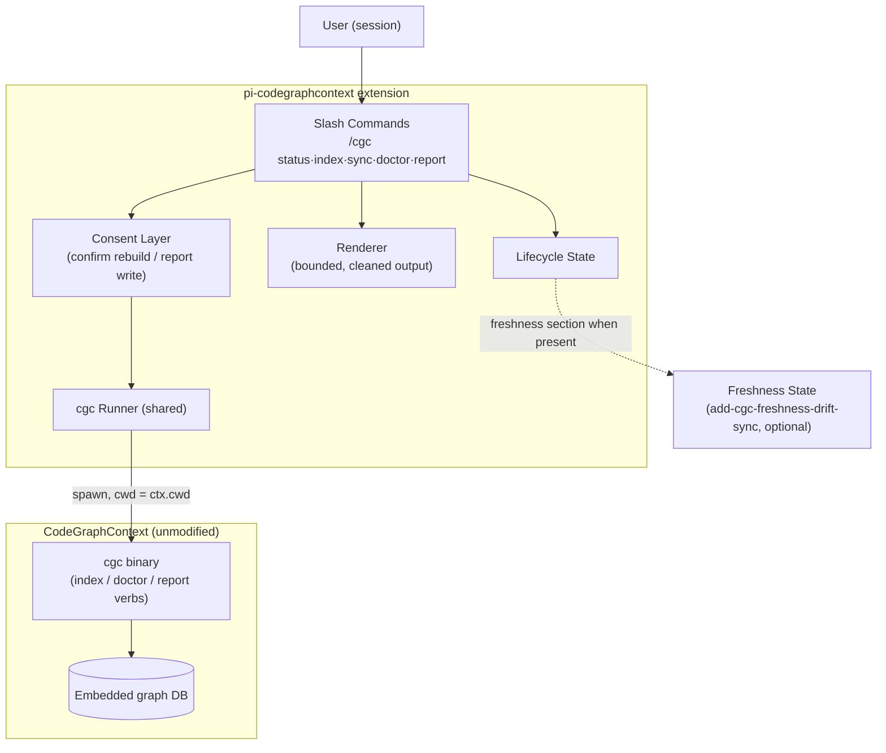

## Context

Change 1 (`add-cgc-session-lifecycle-gate`) produces lifecycle state; ADR-0001 fixed the integration boundary (wrap-only `cgc` spawns through one runner, no query tools registered). What is missing is the human surface: the MCP server serves the agent, but the person watching the session cannot see or steer index work without leaving to a shell. Pi's extension API provides command registration (validated against installed docs: `pi.registerCommand()`).

In-force ADRs: `adr/0001-cgc-binary-only-integration.md` (Proposed) and `adr/0002-readiness-gated-nonconfigurable-guidance.md` (Proposed). Both constrain this design: commands spawn `cgc` through the shared runner only, and nothing here registers agent tools. The user-facing command set deliberately excludes CGC verbs gated by `ALLOW_DB_DELETION` (delete/clean).

## Goals / Non-Goals

**Goals:**

- Five commands (`/cgc status|index|sync|doctor|report`) that make the lifecycle state visible and give the human consent-guarded control over index, sync, doctor, and report actions.
- One consent model, reused everywhere: creation follows the auto-create opt-in; force rebuild and report file-writes require explicit in-session confirmation.
- Degrade gracefully across the campaign: status renders freshness only when `add-cgc-freshness-drift-sync` is present.

**Non-Goals:**

- No agent-facing tools from these commands (deferred decision recorded in the proposal: thin convenience tools are future consideration, deliberately avoiding duplication of the CGC MCP server's `analyze_code_relationships`).
- No new CGC semantics: every command is a thin renderer/trigger over existing `cgc` verbs and the lifecycle state machine.
- No database deletion or cleanup surface, ever.
- No continuous progress UI (the persistent status display is `add-cgc-status-hud`; commands are on-demand).

## Decisions

### D1: Commands are thin renderers over the shared runner and lifecycle state

**Decision:** Each command resolves state (or triggers the runner) and renders; none re-implements detection, consent, or process logic.

**Rationale:** One state machine and one runner already exist (ADR-0001); duplicating them in command handlers would fork behavior between the session-start gate and the human surface.

**Alternatives considered:**

- *Commands calling `cgc` directly via a private spawn path* — rejected: bypasses dedup, timeouts, and cleanup guarantees.
- *Headless re-implementation of status from filesystem only* — rejected: would disagree with the gate's classification.

### D2: One consent model with explicit confirmation for destructive or file-writing actions

**Decision:** `index --force` (replaces an existing index) and `report` (writes `CGC_REPORT.md`) require an explicit in-session confirmation; `sync` and `doctor` are non-destructive and run without one; `index` on an unindexed workspace follows the auto-create consent gate from change 1.

**Rationale:** Matches CGC's own safety posture (deletion is separately gated and remains unexposed) and the reference-extension principle that destructive automation must be opt-in, visible, and declined-able.

**Alternatives considered:**

- *Confirmation for everything* — rejected: read-only and non-destructive actions (`status`, `doctor`, `sync`) would train the user to confirm reflexively.
- *Config flag to skip confirmations* — rejected for now: silent rebuilds are precisely the accident class this surface exists to prevent.

### D3: Busy conflicts surface as notices, not errors

**Decision:** `sync` (and any index action) that hits an embedded-database lock reports the busy state with a one-time notice naming the conflict — identical to the gate's skip-as-busy policy — and exits the command cleanly.

**Rationale:** Same single-process reality as ADR-0001's Decision prose ("lock/busy conflicts are skipped with a one-time notice"); commands must not fight locks any more than the gate does.

### D4: Output hygiene for rendered command output

**Decision:** All command output passes through the shared bounding policy (size-capped with explicit truncation marker, head+tail preserved) and strips control sequences before rendering.

**Rationale:** `cgc doctor`/`cgc report` emit rich terminal output; unbounded or ANSI-laden output would pollute the session transcript. This renderer pre-adapts to ADR-0005's universal output-policy pipeline (the target the shared bounding policy converges on), and ADR-0004's passive-renderer rule governs how status output is rendered.

### Architecture (C4 — component level)

## Risks / Trade-offs

- [Long-running `index`/`report` inside a command blocks the user's session] -> Commands trigger background work and render progress state; the runner's time budget and abort still apply; nothing in a command handler awaits completion inline.
- [User triggers `sync` while the session-start gate is already syncing] -> Shared runner deduplication returns the in-flight job; the command renders its progress instead of spawning a duplicate.
- [Confirmation fatigue trains reflexive approval] -> Confirmations exist only for the two destructive/file-writing actions; everything else is one keystroke and safe by construction.
- [Doctor output varies across CGC versions] -> Rendering is passthrough with bounding and ANSI stripping; no semantic parsing of doctor output beyond success/failure.
- [Report writes a file users did not expect] -> Explicit confirmation names the destination path before any write.

## Migration Plan

- No migration. Rollback = disable the extension (commands disappear with it).
- With `add-cgc-freshness-drift-sync` absent, `/cgc status` omits the freshness section (specified degradation, not an error).

## Open Questions

- None blocking. (The deferred thin-convenience-tools decision is recorded in the proposal and deliberately not designed here.)
