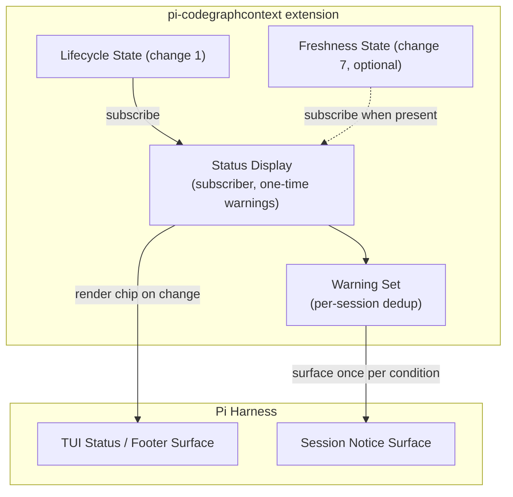

## Context

Changes 1–3 established the data and control surfaces: lifecycle state (`add-cgc-session-lifecycle-gate`), guidance (`add-cgc-agent-routing-guidance`), and human commands (`add-cgc-slash-commands`). What remains invisible is ongoing health: a user cannot tell ready from stale from busy without typing `/cgc status`. Reference extensions (CKG's HUD, EstebanForge's footer status) demonstrate that a quiet, always-visible chip plus one-time warnings converts invisible background work into trust — and that such displays must be strictly passive and headless-safe to avoid harming the sessions they inform.

In-force ADRs: `adr/0001` (wrap-only, fail-open), `adr/0002` (guidance contract), `adr/0003` (consent model). This display registers no tools, injects no agent content, and triggers no actions — it renders state that already exists.

## Goals / Non-Goals

**Goals:**

- A glanceable one-line chip: ready / unindexed / busy / corrupt / unavailable, with activity states (indexing…, syncing…) while work runs.
- One-time-per-session warnings for the four conditions users must know about, each with the relevant next-step hint.
- Strict passivity: render only from state; never spawn, never poll, never block, never touch the agent context; no-op when headless.

**Non-Goals:**

- No interactive controls in the chip (actions live in `/cgc` commands; ADR-0003's consent model applies there).
- No agent-facing injection (owned by changes 2 and 10).
- No history/log rendering, no metrics dashboards — one line and warnings only.
- No new lifecycle detection: the display trusts the gate's classification entirely.

## Decisions

### D1: Event-driven render from state subscriptions

**Decision:** The display subscribes to lifecycle (and optional freshness) state updates and re-renders only on change; there is no timer, no polling, and no query on render.

**Rationale:** Polling would either waste spawns or show stale data; the state machine already emits transitions, so renders are free and always current.

**Alternatives considered:**

- *Poll every N seconds* — rejected: violates passivity; invites accidental `cgc` invocations.
- *Render on every agent turn* — rejected: couples display cost to turn rate and can still be stale.

### D2: One-time warnings via a per-session condition set

**Decision:** Each warning condition (cgc-missing, unindexed, busy, corrupt) is surfaced at most once per session, tracked by a session-scoped set; re-entering a shown condition is silent.

**Rationale:** Repeating identical warnings trains users to ignore them; once is enough because the chip keeps the state visible.

**Alternatives considered:**

- *Repeat until acknowledged* — rejected: there is no reliable acknowledgement mechanism in a passive chip; the chip itself is the persistent reminder.
- *Only chip, no notices* — rejected: first-run users need the "why" (especially the unindexed case, where the fix is opt-in guidance).

### D3: The display never spawns — detail comes only from captured state

**Decision:** The chip renders exclusively from lifecycle/freshness state fields; optional detail (e.g., backend name) appears only when an existing probe already captured it. The display code has no access to the runner.

**Rationale:** Makes "the display cannot cause invocations" structurally true rather than a convention, and keeps the TUI layer trivially testable.

**Alternatives considered:**

- *Lazy `cgc config show` on first render for backend detail* — rejected: a display-triggered spawn contradicts passivity and can hit the same locks the gate avoids.

### D4: Headless detection gates the entire display module

**Decision:** The display module activates only when the session runs in TUI mode — guarded by `ctx.mode === "tui"` (not `ctx.hasUI`, which is also true in RPC mode per the installed docs' mode table). Outside TUI mode the module deactivates entirely (no rendering, no warning notices through TUI surfaces — warnings then ride the existing lifecycle one-time notices from change 1, which are session-level, not TUI-level).

**Rationale:** The reference-CKG insight: cosmetic surfaces must be no-ops outside the TUI so CI/headless use is never perturbed.

### Architecture (C4 — component level)

## Risks / Trade-offs

- [Pi TUI status/footer API differs from expectations] -> The exact surface is pinned from installed Pi docs at implementation time and validated at the validate phase; if no embeddable footer surface exists, the fallback is rendering the chip as a session notice on state change only (still passive, still once per change) — decided before coding, not discovered mid-way.
- [State transition storms cause render churn] -> Renders are debounced (coalesce transitions within a short window into one render); the chip is one line, so cost is trivial even in the worst case.
- [Warnings annoy despite once-per-session] -> Conditions are few (four), each with an actionable hint; the chip carries the persistent state so notices never need to repeat.
- [Display code accidentally grows spawns] -> Structural guard: the display module has no reference to the runner; enforced by module boundaries and a lint/test assertion.

## Migration Plan

- No migration. Rollback = disable the extension (chip and warnings disappear with it).
- Absent freshness capability, the chip renders lifecycle state only (specified degradation).

## Open Questions

- Resolved during validation: the TUI surfaces are pinned as `ctx.ui.setStatus(key, text)` (persistent footer status) / `ctx.ui.setFooter(renderFn)` for the chip and `ctx.ui.notify(message, severity)` for one-time notices; the headless/TUI guard is `ctx.mode === "tui"` because `ctx.hasUI` is also true in RPC mode (validator verdicts PT1–PT3).
- None blocking otherwise.
