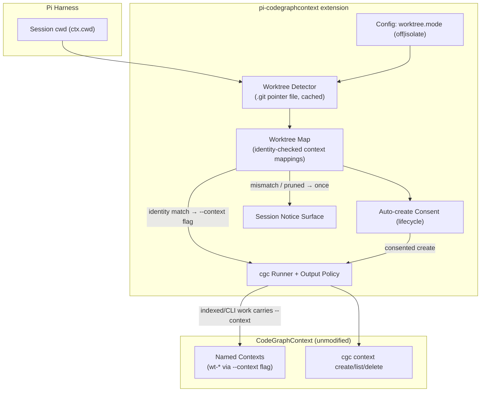

## Context

Worktrees multiply one repository into several live checkouts on different branches. CGC's context model already contains the needed primitive — three resolution modes (global / per-repo / named) with named contexts addressable via `--context` on any CLI invocation and managed by documented `cgc context` verbs (creation optionally selects the database; deletion removes only the registration, preserving database files). What CGC lacks is worktree awareness: nothing keys a context to a worktree identity, nothing verifies that a context still belongs to the worktree using it, and nothing notices when a pruned worktree leaves an orphan. Reference practice (isac322's worktree-aware extension) established the correctness requirements: distinct graphs per worktree, identity-checked against the git common dir, fail-closed on mismatch, and cleanup after worktree removal.

In-force ADRs: `adr/0001` (wrap-only runner), `adr/0002` (guidance contract), `adr/0003` (consent model — no autonomous deletions), `adr/0004`/`adr/0005` (renderers/output), `adr/0006` (the `/cgc_context` tool is the user-driven cleanup path), `adr/0007` (freshness posture). This change composes with the lifecycle gate: a worktree context is created under the same auto-create consent gate, and the gate's detection/classification then runs against that context.

## Goals / Non-Goals

**Goals:**

- Correct isolation: each opted-in worktree's extension-managed index lives in its own named context; no branch mixing.
- Fail-closed correctness: a context whose identity no longer matches is refused, never silently queried.
- Zero-spawn detection: worktree membership read from the `.git` pointer file.
- Honest scope: the extension isolates its own maintenance surface; MCP-server query isolation remains CGC's own discover/switch mechanism, documented rather than hijacked.

**Non-Goals:**

- No control over the user's CGC MCP server context: the extension cannot (and must not) switch the MCP server's session; interplay is documented for the guide (the MCP server's own `switch_context` tool remains the user-driven path).
- No autonomous cleanup: stale worktree contexts surface notices only; deletion stays behind the consent layer (ADR-0003) via `/cgc_context`.
- No change to main checkouts, non-git directories, or default-mode behavior.
- No sharing/symlinking of databases between worktrees (the reference extension's central-store-plus-symlink trick is unnecessary here — CGC named contexts already centralize storage under `~/.codegraphcontext/contexts/`).

## Decisions

### D1: Detection reads the `.git` pointer file — zero spawns

**Decision:** A linked worktree is identified by its `.git` being a file containing `gitdir: <common>/worktrees/<id>`; the extension parses this pointer once per session and caches the identity (repository common directory + worktree id). Main checkouts have a `.git` directory and are reported as non-worktrees. Caveat (validator-confirmed): submodule checkouts also use a `.git` gitfile, so membership requires verifying the gitdir target sits under the repository's `.git/worktrees/` prefix — a gitfile alone is not proof of worktree membership.

**Rationale:** The pointer file is git's own stable on-disk contract; reading it costs nothing, avoids spawning `git` (which would sit oddly in a `cgc`-only runner), and cannot contend for locks.

**Alternatives considered:**

- *Spawn `git worktree list --porcelain`* — rejected: a second binary in the runner violates the wrap-only boundary's simplicity and buys nothing over the pointer file.
- *Watch for worktree changes during the session* — rejected: worktrees don't move mid-session; resolve once.

### D2: Isolation rides CGC named contexts, keyed `wt-<worktree-id>`

**Decision:** In `isolate` mode, each worktree maps to a named context named `wt-<worktree-id>` (created on demand via documented `cgc context create`, with the auto-create consent gate); every extension runner invocation for that workspace carries `--context wt-<id>`.

**Rationale:** Named contexts are CGC's own isolation primitive — centrally stored, listed, and deletable — so the extension composes with the ecosystem (including `/cgc_context` management) instead of inventing a parallel mechanism.

**Alternatives considered:**

- *Per-repo mode inside each worktree* — zero-code and available today, but scatters `.codegraphcontext/` directories across worktrees, indexes nothing centrally, and cannot be listed/GC'd coherently; documented in the guide as the manual alternative.
- *Central store plus symlinks (reference-extension trick)* — rejected: redundant with named contexts and adds symlink fragility CGC's model doesn't need.

### D3: Identity records make mappings verifiable and fail-closed

**Decision:** Each mapping records `{context name, repository common dir, worktree id}`; at resolution, a mismatch (different repository, missing worktree pointer, or a context recreated against another workspace) produces an identity-mismatch state — no extension indexing, syncing, or tool invocation uses the mismatched context until the user re-consents.

**Rationale:** The dangerous failure is silent wrong-graph answers across branches; failing closed converts that into a visible error. This is the reference extension's hardest-won insight.

**Alternatives considered:**

- *Trust the context name* — rejected: names are user-editable; identity is not.
- *Auto-repair mismatches by re-creating contexts* — rejected: destructive-adjacent automation; the user decides via consent.

### D4: Cleanup is a notice plus a user-driven path — never autonomous

**Decision:** Pruned worktrees (mapping target missing on disk) surface a one-time notice naming the orphaned context and `/cgc_context delete`; the extension itself never deletes registrations or files.

**Rationale:** ADR-0003 reserves deletions for the consent layer; the notice costs the user one command and keeps the extension incapable of surprise removals.

**Alternatives considered:**

- *Auto-GC after worktree removal* — rejected: "removal" detection can misfire (temporarily unmounted dirs, moved checkouts); the notice is safe and sufficient.

### Architecture (C4 — component level)

## Risks / Trade-offs

- [Worktree identities shift (re-added worktrees get new ids)] -> Identity records catch it: the old mapping fails closed, the user re-consents to a fresh context; no silent reuse.
- [Manual context edits by users (renames, deletions)] -> Identity checks treat any inconsistency as mismatch — noisy but safe; `/cgc_context list` makes the true state visible.
- [Users expect MCP queries to hit the worktree's graph automatically] -> Explicitly out of scope and documented: MCP query context is the user's MCP server session (its own `switch_context` tool); the extension isolates only its own maintenance surface. The guide carries this interplay note.
- [Detection misreads unusual setups (submodules, `.git` file pointing outside standard layout)] -> Fail-open: malformed pointers degrade to non-worktree behavior with a recorded error; nothing crashes.
- [Context name collisions (`wt-` prefix taken)] -> Creation verifies uniqueness and surfaces a structured error; the identity record, not the name, is the source of truth.

## Migration Plan

- No migration; default `off` means no behavior change until opted in. Rollback = set `worktree.mode=off` (mappings are inert records; cleanup of any created contexts is user-driven via `/cgc_context`).

## Open Questions

- None blocking. (Worktree-id stability across git versions is handled by fail-closed identity checks rather than assumptions.)
